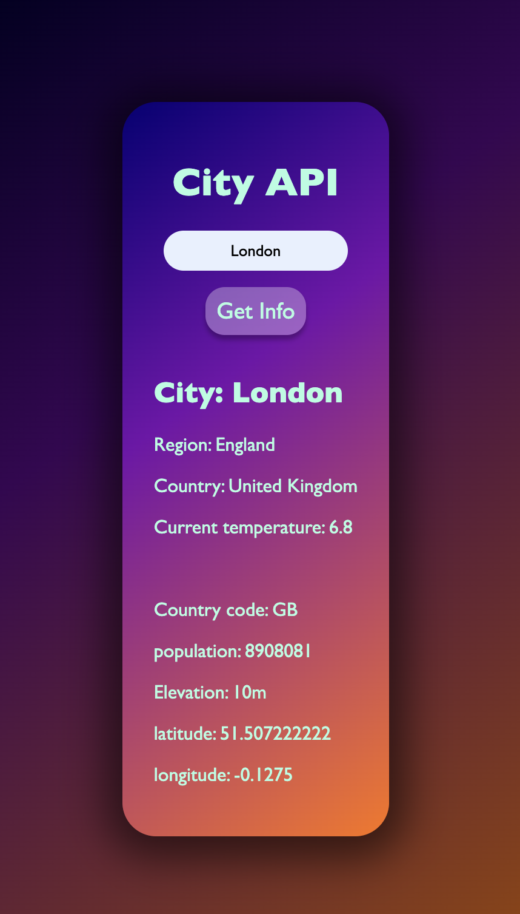

# City_API

A web app that searches and display baisc city information with real time temperature

_The city search results are sorted by population._
_The city displayed will be the closest match to the name input, with preference given to the most populated result._

## City information

Displays a city basic information fetching data from the https://wft-geo-db.p.rapidapi.com API
It uses async function, fetch and try catch error method.
It also usees DOM manipulation to display the data on a HTML user interface.

## Usage

1. Go to https://madgrv.github.io/City_API/ alternatively download the project folder and open `index.html` in a browser.
2. Enter the name of the city you are looking for.
4. Click the "Get Info" button to see the result.

## Screenshots

